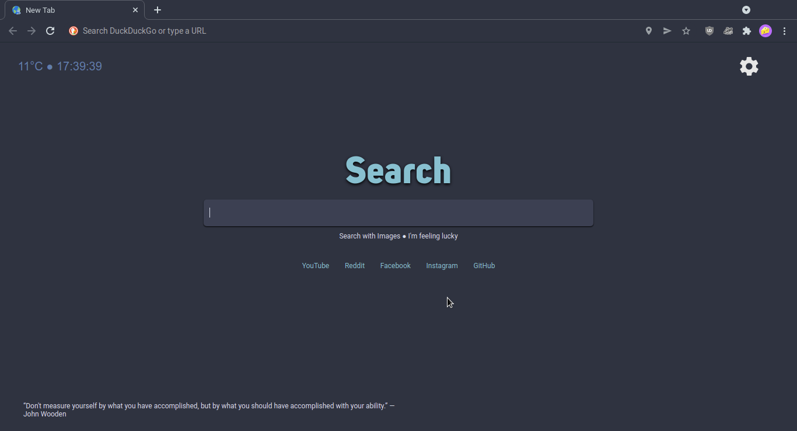

# Nord NewTab
A chromium extension which offers the best look New Tab with [Nord theme](https://www.nordtheme.com/). 
It's also includes clock, weather and random positive quotes widgets build-in. 
The search engine included is [DuckDuckGo](https://duckduckgo.com).

> NOTE: The extension requires your location's latitude and longitude for making weather's data more accurate.

# How to install
Clone this repository, then go to [chrome's extension manager](chrome://extensions/) and drag&drop the folder where the source code is included into that page.
# Firefox support
I don't know if it's supports because I don't use Firefox.
# License
MIT